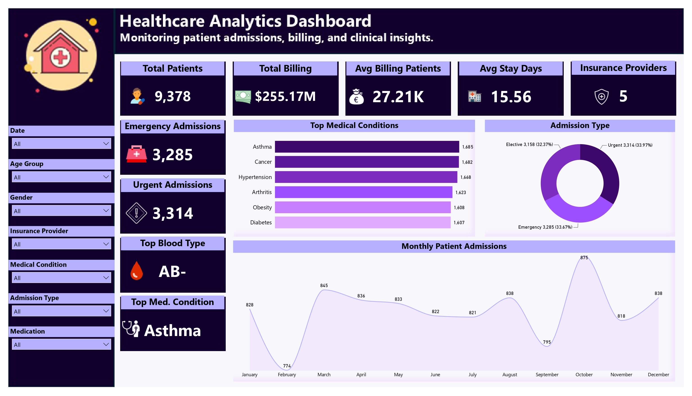
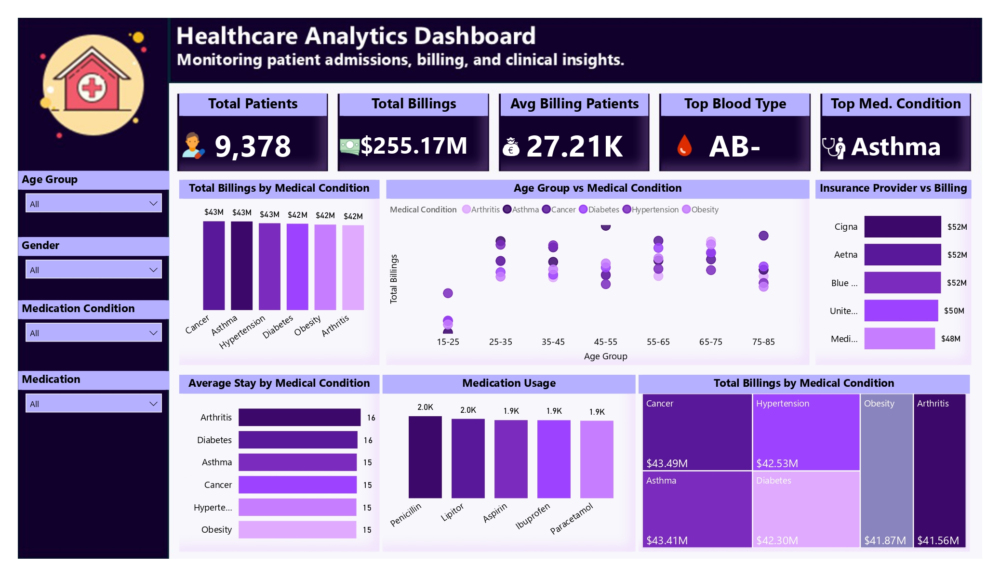
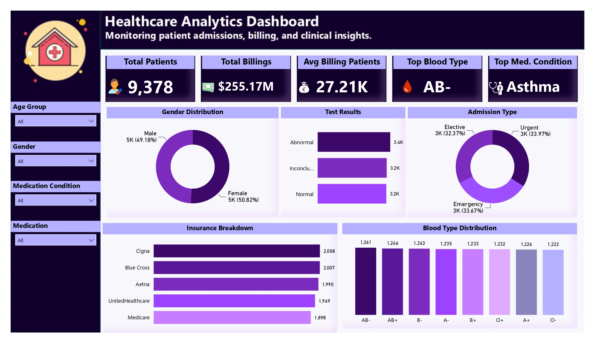

# 🏥 Healthcare Analytics Dashboard | Power BI

An interactive **Healthcare Analytics Dashboard** built in **Power BI** to analyze patient demographics, hospital admissions, billing performance, insurance providers, medical conditions, and operational trends. This project demonstrates end-to-end business intelligence skills, from data transformation to dashboard design and insight generation.

---

## 📌 Project Overview

Healthcare organizations generate massive amounts of operational data every day. This dashboard transforms raw healthcare records into actionable insights that support data-driven decision-making.

The dashboard enables users to:

- Monitor patient admissions and discharge trends
- Analyze hospital billing performance
- Explore medical condition distributions
- Compare insurance provider contributions
- Identify seasonal admission patterns
- Track patient demographics
- Evaluate hospital operational performance

---

## 🎯 Business Objectives

- Understand patient admission trends
- Identify the most common medical conditions
- Monitor healthcare billing performance
- Compare insurance provider contributions
- Analyze patient demographics
- Support hospital resource planning through interactive visualizations

---

# 📊 Dashboard Pages

## 1️⃣ Executive Summary

Provides a high-level overview of hospital performance using KPI cards and interactive visuals.

### KPIs

- Total Patients
- Total Billing
- Average Billing per Patient
- Average Hospital Stay

### Visualizations

- Monthly Admission Trend
- Admission Type Distribution
- Patient Gender Distribution
- Patient Age Distribution
- Billing by Medical Condition

---

## 2️⃣ Medical Insights

Focuses on disease prevalence and healthcare utilization.

### Includes

- Medical Condition Distribution
- Average Stay by Medical Condition
- Billing by Medical Condition
- Medication Analysis
- Blood Group Distribution

---

## 3️⃣ Billing & Insurance Analysis

Provides financial insights into hospital operations.

### Includes

- Billing by Insurance Provider
- Billing by Hospital
- Billing by Admission Type
- Test Results Analysis
- Interactive Filters

---

# 📈 Key Insights

### 👥 Patients

- **9,378 Total Patients**
- Balanced gender distribution
- Patients span multiple age groups

### 💰 Financial

- **$255.17 Million Total Billing**
- **$27.21K Average Billing per Patient**

### 🏥 Admissions

- Emergency: **3,285**
- Urgent: **3,314**
- Elective: **3,158**

Admissions are distributed relatively evenly across all categories.

### 🩺 Medical Conditions

- Asthma recorded the highest patient volume.
- Cancer and Hypertension followed closely.
- Billing remained consistently distributed across major diseases.

### 📅 Trends

- October experienced the highest patient admissions.
- February recorded the lowest.
- Average hospital stay remained stable across conditions.

### 🛡 Insurance

Major insurance providers contributed similar billing amounts, indicating a balanced payer mix.

---

# 🛠 Tools & Technologies

- Microsoft Power BI
- Power Query
- DAX (Data Analysis Expressions)
- Data Modeling
- Microsoft Excel

---

# 📚 Skills Demonstrated

- Data Cleaning
- ETL using Power Query
- Data Modeling
- Star Schema Design
- DAX Measures
- KPI Development
- Dashboard Design
- Interactive Reporting
- Business Intelligence
- Data Storytelling

---

# 📂 Repository Structure

```
Healthcare-Analytics-Dashboard
│
├── Healthcare Dashboard.pbix
├── Dashboard.pdf
├── Dashboard.png
├── Dataset.xlsx
├── README.md
└── assets
    ├── Overview.png
    ├── Medical Insights.png
    └── Billing Analysis.png
```

---

# 📸 Dashboard Preview

## Executive Summary



---

## Medical Insight



---

## Billing & Insurance Analysis




---

# 🚀 Project Highlights

✔ Interactive Power BI Dashboard

✔ Dynamic KPI Cards

✔ Advanced DAX Measures

✔ Slicers & Cross Filtering

✔ Business-Oriented Insights

✔ Professional Dashboard Design

✔ Data Storytelling

---

# 💡 Future Improvements

- Drill-through pages
- Row-Level Security (RLS)
- Predictive analytics using Python
- Real-time dashboard integration
- Healthcare forecasting models

---

# 👨‍💻 About Me

**Maaz Khan**

🎓 BS Statistics | University of Malakand

📊 Aspiring Data Analyst

### Technical Skills

- Power BI
- SQL
- Python
- PostgreSQL
- Excel
- DAX
- Power Query
- Statistics
- Git & GitHub

---

## 📬 Connect With Me

**LinkedIn**
https://linkedin.com/in/maaz-khan-wrangler

**GitHub**
https://github.com/maaazkhannnnn-gif

---

⭐ If you found this project interesting, consider giving it a **Star**!